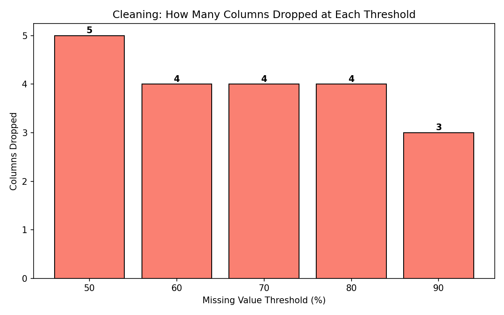
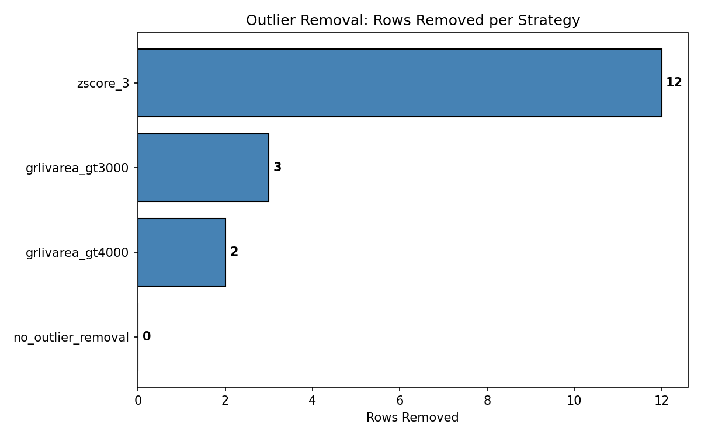
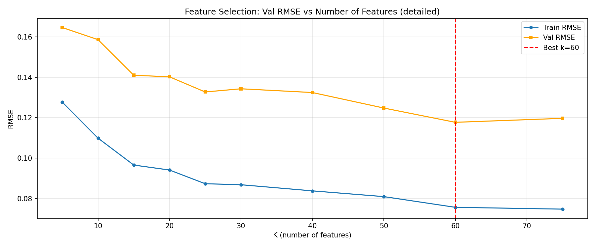
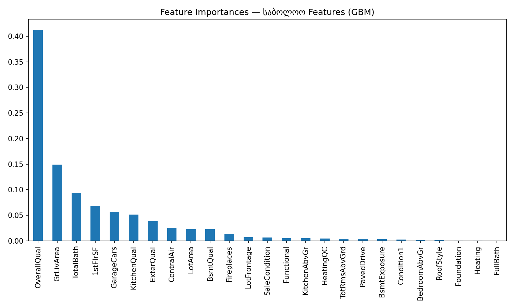
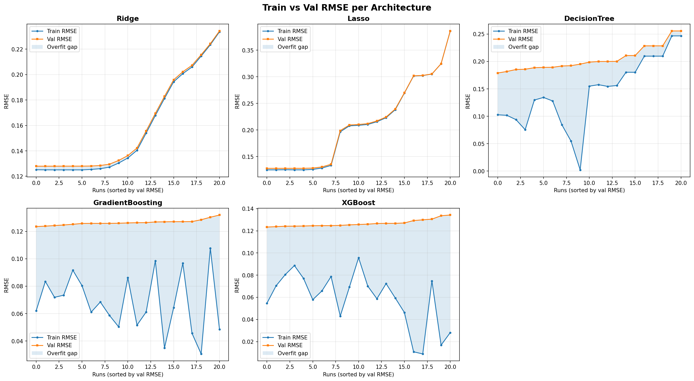
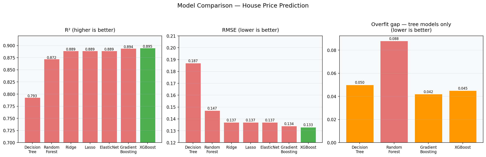

# სახლის ფასების პროგნოზი

81 სვეტი, 79 მახასიათებელი
ვპროგნოზირებთ სახლის ფასს მის მახასიათებლებზე დაყრდნობით. 
მიდგომა ასეთია:
1. Cleaning — გამოტოვებული მნიშვნელობების და outlier-ების დამუშავება
2. Feature Engineering — ახალი მახასიათებლების შექმნა
3. Feature Selection — 85 ცვლადიდან საუკეთესოების გამორჩევა
4. Training — სხვადასხვა მოდელის ტესტირება, ყველა ექსპერიმენტი MLflow-ში
5. Inference — საუკეთესო მოდელის Model Registry-დან ჩატვირთვა და submission-ის გენერაცია

# რეპოს სტრუქტურა
house-prices-mlflow/
├── model_experiment.ipynb  # ექსპერიმენტებს ვატარებ აქ
├── model_inference.ipynb   # პროგნოზები საუკეთესო მოდელით
├── README.md               # პროექტის დოკუმენტაცია
└── data                    # csv ფაილები, დატა

# Cleaning
ამ ეტაპზე მთლიან დატაში ვამუშავებ NaN მნიშნელობებს
სულ აღმოჩნდა, რომ მთელს დატაში არის გამოტოვებული მნიშნელობების 19 სვეტი. 
დავადგინე თითოეულ სვეტს დატას რა პროცენტი აკლია.

1. თუკი სვეტში მნიშვნელობების >80% არის NaN, მაშინ ასეთ სვეტებს საერთოდ ვიღებ, რადგან ეს სვეტები პრაქტიკულად ცარიელია და სასარგებლო ინფორმაციას არ შეიცავს.
   PoolQC (99.5%), MiscFeature (96.3%), Alley (93.8%), Fence (80.8%)
2. იყო სვეტები, სადაც კონკრეტულ სახლს რაღაც feature საერთოდ არ გააჩნდა, ამიტომ NaN ასეთ სვეტებში None-ად ჩავანაცვლე, რომ მივანიშნო, რომ კონკრეტულ სახლს ეს მახასიათებელი არ აქვს.
   FireplaceQu, GarageType, BsmtQual და ა.შ...
3. ანალოგიურად ჩავანაცვლე NaN 0-ით სვეტებში, სადაც თუკი რაღაც მახასიათებელი არ არსებობდა, მისი ფართობი მაგალითად უნდა ყოფილიყო ნული
   GarageArea, GarageCars, BsmtFinSF1 და ა.შ...
4. LotFrontage სვეტი შევავსე სამეზობლოს მედიანური მნიშვნელობით, რადგან ეს მახასიათებელი სამეზობლოზეა დამოკიდებული — ერთ სამეზობლოში მდებარე სახლებს მსგავსი LotFrontage აქვთ.
5. წავშალე Utilities სვეტი, რომლის ყველა მნიშვნელობა ასე თუ ისე ერთი და იგივე იყო ყველგან (AllPub) და არაფერს არ იძლეოდა ინფორმაციულობის თვალსაზრისით
6. ვინაიდან მოდელისთვის რთულია დიდ მნიშნელობებზე მუშაობა, ფასებზე მოვდე log1p() ტრანსფორმაცია, რითაც ლოგარითმი მარჯვნივ გადახრილი ფასების განაწილების გავლენას შეამცირებს და მოდელს გაუადვილებს სწავლას.
7. გავტესტე სხვადასხვა threshold-ი (50%, 60%, 70%, 80%, 90%) და გავლოგე თითოეულ შემთხვევაში რამდენი სვეტი იწაშლება:

 
შედეგი:
80%-ის threshold-ზე ოპტიმალურია
წაიშლება 4 სვეტი (`PoolQC`, `MiscFeature`, `Alley`, `Fence`), სადაც დატას 80%+ მონაცემი აკლია
50%-ზე ზედმეტი სვეტები იშლება და სასარგებლო ინფორმაცია იკარგება, ხოლო 90%-ზე არარელევანტურ სვეტებს ტოვებს, რომლებიც არ გვჭირდება
როდესაც სვეტში 80%-ზე მეტი მონაცემი აკლია, ამ ცარიელი ადგილების შევსება მნიშნელობებით უფრო მეტ noise-ს შემოიტანს, ვიდრე სასარგებლო ინფორმაციას
მოდელი არარსებული კანონზომიერებების სწავლას დაიწყებს, რაც საბოლოოდ overfit-ს გამოიწვევს.

8. Outlier-ების მოცილება
შევამოწმე 4 სტრატეგია:
 

no_outlier_removal -> იშლება - 0  -> მოდელი ისწავლის edge case-ებზე, რაც არ გვაწყობს
grlivarea_gt4000   -> იშლება - 2  -> 2 სახლი: 4000+ კვ.ფუტი + $200k-ზე ნაკლები ფასი — ოპტიმალურია
grlivarea_gt3000   -> იშლება - 3  -> ვალიდური მონაცემები იკარგება
zscore_3           -> იშლება - 12 -> ძალიან ბევრი დატა იშლება და იკარგება
                           
დასკვნა:
ოპტიმალურია grlivarea_gt4000, რომლის გამოყენებისასაც იშლება 2 outlier
წაიშალა 2 ანომალიური სახლი, სადაც ხდებოდა არასწორი კავშირის სწავლება — 4000+ კვადრატული სახლი $200,000-ზე იაფად იყიდებოდა. 
მოდელი სწავლობდა, რომ დიდი ფართობის მქონე სახლი იაფად უნდა გაყიდულიყო, რაც რეალობას არ შეესაბამება.

# Feature Engineering

შევქმენი ახალი feature-ები, რომლებიც ჩავთვალე, რომ უკეთ პროგნოზირებდა ფასს

1. TotalSF - სახლის მთლიანი ფართობი (კორელაცია ფასთან: 0.818 — მეორე საუკეთესო ნიშანი აღმოჩნდა)
2. TotalBath - მთელ სახლში სააბაზანოების სრული რაოდენობა
3. HouseAge - (გაყიდვის წელს - აშენების წელი) - რამდენი ხნისაა სახლი - (ძველი სახლი -> დაბალი ფასი)
4. RemodelAge - (გაყიდვის წელს - ბოლო რემონტის წელი) - რემოდელირებიდან რა დროა გასული (ახალი რემონტი -> მაღალი ფასი)
5. HasGarage - აქვს თუ არა გარაჟი
6. HasBsmt - აქვს თუ არა სარდაფი
7. Has2ndFloor - მეორე სართული აქვს თუ არა
8. QualCond - (OverallQual * OverallCond) - სახლის ჯამური ხარისხი როგორია (კორელაცია: 0.608)
9. PorchSF - OpenPorchSF + EnclosedPorch + 3SsnPorch + ScreenPorch - გარე სივრცის კვადრატულობა

გამოვიყენე ordinal და label encoding
შევცვალე კატეგორიული სვეტების სახელები რიცხვითი თანმიმდევრული მნიშვნელობებით, რადგან მოდელს რიცხვები ესმის და არა სიტყვები
None=0, Po=1, Fa=2, TA=3, Gd=4, Ex=5
ხოლო დანარჩენ 29 სვეტში ალფაბეტური რიგითობის მიხედვით მივანიჭე რიცხობრივი მნიშვნელობა

51 რიცხვით სვეტს ასევე ჰქონდა სტატისტიკური გადახრა skewness>0.75 ამიტომ ამათზეც მოვდეთ log1p() ტრანსფორმაცია, რათა მოდელს უკეთესად აღექვა დატა

# Feature Selection

გამოვიყენე 3-ეტაპიანი ავტომატური pipeline, სადაც თითოეული ეტაპი MLflow-ში დალოგილია და საუკეთესო პარამეტრი ავტომატურადაა შერჩეული.
SelectKBest (84→60) → კორელაციის ფილტრი (60→49) → RFE (49→25)

1) SelectKBest (f_regression) — k sweep
შევამოწმე k = 5-დან 75-მდე. თითოეულზე GBM მოდელი დავატრენინგე და val RMSE გავზომე:

| k  | Train RMSE | Val RMSE | შეფასება                                  |
|----|------------|----------|-------------------------------------------|
| 5  | 0.1277     | 0.1646   | underfitting — ძალიან ცოტა მახასიათებელია |
| 10 | 0.1099     | 0.1586   | underfitting                              |
| 25 | 0.0873     | 0.1327   | კარგი ბალანსი                             |
| 60 | 0.0757     | 0.1177   | საუკეთესო val RMSE ← ამას ვირჩევთ         |
| 75 | 0.0748     | 0.1197   | უარესდება                                 |

დასკვნა: 
k=5 და k=10 აშკარა underfitting-ია. 
val RMSE მკვეთრად ეცემა k=25-მდე, შემდეგ ნელდება. 
k=60 საუკეთესო val RMSE-ს იძლევა, ამიტომაც შეირჩევა პირველი ეტაპისთვის, რათა შემდგომ ფილტრაციისთვის საკმარისი დატა გვქონდეს.

2) კორელაციის ფილტრი
სამ threshold-ზე გავტესტე და თითოეული MLflow-ში დავლოგე:

| threshold | წაშლილების რაოდენობა | დარჩენილი | Val RMSE               |
|-----------|----------------------|-----------|------------------------|
| 0.80      | 13                   | 47        | 0.1190                 |
| **0.85**  | **11**               | **49**    | **0.1163** ← საუკეთესო |
| 0.90      | 7                    | 53        | 0.1176                 |

0.80 — ზედმეტად მკაცრია, სასარგებლო feature-ებიც იკარგება
0.85 — ოპტიმალური ბალანსია, val RMSE მინიმალურია
0.90 — ძალიან რბილი, redundant feature-ები რჩება

წაშლილი მახასიათებლები (threshold=0.85): 
`BsmtCond`, `FireplaceQu`, `GarageArea`, `GarageQual`, `GarageCond`, `TotalSF`, `HouseAge`, `RemodelAge`, `HasGarage`, `HasBsmt`, `Has2ndFloor`

60 → 49

3) RFE

Ridge მოდელის კოეფიციენტების მიხედვით თანდათანობით იშლება სუსტი მახასიათებლები. 
გავტესტე სამ მნიშვნელობაზე:

| n      | Train RMSE | Val RMSE                      |
|--------|------------|-------------------------------|
| 20     | 0.0964     | 0.1392                        |
| 22     | 0.0945     | 0.1382                        |
| **25** | **0.0943** | **0.1367** ← საუკეთესო შედეგი |

RFE-ს შედეგი გადავამოწმე ორი სხვადასხვა მოდელით:
- Ridge val RMSE: **0.1368**
- GBM val RMSE: **0.1367**

თითქმის იდენტური შედეგი ნიშნავს რომ შერჩეული მახასიათებლები ორივე მოდელზე მიდის.
ანუ RFE-ს შედეგი სანდოა.

49 → 25

საბოლოოდ, შეირჩა 25 მახასიათებელი
`LotFrontage`, `LotArea`, `Condition1`, `OverallQual`, `RoofStyle`, `ExterQual`, `Foundation`, 
`BsmtQual`, `BsmtExposure`, `Heating`, `HeatingQC`, `CentralAir`, `1stFlrSF`, `GrLivArea`, 
`FullBath`, `BedroomAbvGr`, `KitchenAbvGr`, `KitchenQual`, `TotRmsAbvGrd`, `Functional`, 
`Fireplaces`, `GarageCars`, `PavedDrive`, `SaleCondition`, `TotalBath`

# Training

გამოვიყენე **5-fold Cross Validation** ყველა მოდელზე — ეს გაცილებით საიმედოა ვიდრე მარტივი train/val split, 
რადგან ამცირებს შეფასების variance-ს და გვიჩვენებს თუ რამდენად სტაბილურია მოდელი სხვადასხვა data split-ზე.

თითოეულ run-ში დავლოგე შემდეგი მეტრიკები:
- `cv_train_rmse`, `cv_val_rmse` — 5-fold cross-validation-ის საშუალო შედეგი
- `train_rmse`, `val_rmse` — holdout set-ზე შეფასება
- `train_mae`, `val_mae` — Mean Absolute Error
- `train_r2`, `val_r2` — R² კოეფიციენტი
- `overfit_gap` — val_rmse − train_rmse (რამდენად overfit-ია მოდელი)

## ტესტირებული მოდელები

გავტესტე 8 სხვადასხვა არქიტექტურა:

| მოდელი           | Run-ები | საუკეთესო val_rmse |
|------------------|---------|--------------------|
| LinearRegression | 1       | 0.1369             |
| Ridge            | 21      | 0.1369             |
| Lasso            | 21      | 0.1368             |
| ElasticNet       | 12      | 0.1368             |
| DecisionTree     | 21      | 0.1794             |
| RandomForest     | 21      | 0.1468             |
| GradientBoosting | 21      | 0.1285             |
| **XGBoost**      | **21**  | **0.1280 ✅**       |

**GBM და XGBoost** ყველაზე დაბალ val RMSE-ს იძლევა. 
**Decision Tree** ნათლად ასახავს overfitting-ს — train RMSE ეცემა ნულამდე, val RMSE კი მაღალი რჩება.

---

## Hyperparameter ოპტიმიზაციის მიდგომა

### 🔹 Linear Regression — 1 run

ბაზისური მოდელი regularization-ის გარეშე — ყველა feature-ის კოეფიციენტი თავისუფლად განისაზღვრება, შეზღუდვა არ გვაქვს.

| Run                       | cv_val_rmse | val_rmse |
|---------------------------|-------------|----------|
| LinearRegression_baseline | 0.1290      | 0.1369   |

Linear Regression წრფივ კავშირს ეძებს მახასიათებლებსა და სახლის ფასს შორის, რეალობაში კი ეს კავშირი არაწრფივია, 
ამიტომაც მისი გავლებული ხაზი და დათვლილი საშუალო ყველგან აცდება რეალობას და მოხდება UNDERFITTING.
Ridge/Lasso წრფივ რეგრესიის ჩასწორებას რეგულარიზაციით ცდილობენ, თუმცა წრფივობის პრობლემას მაინც ვერ წყვეტენ
სწორედ ამიტომ ეს სამი მოდელი მიახლოებით ერთნაირ შედეგებს(val RSME) იძლევა ვალიდაციის დატაზე.

---

## 🔹 Ridge Regression (L2 რეგულარიზაცია) — 21 run

L2 regularization — ყველა კოეფიციენტს ამცირებს, სასჯელს ამატებს დიდ კოეფიციენტებზე, მაგრამ ნულამდე არ დაყავს. 
alpha რაც დიდია, მით ძლიერია სასჯელი — მოდელი უფრო ფრთხილი ხდება.
alpha-ს ზრდა = ძლიერი რეგულარიზაცია.

alpha=0.01       holdout_val_r2=0.888849  val_r2=0.892596  holdout_val_rmse=0.136884
alpha=0.05       holdout_val_r2=0.888858  val_r2=0.892613  holdout_val_rmse=0.136879
alpha=0.1        holdout_val_r2=0.888869  val_r2=0.892632  holdout_val_rmse=0.136872
alpha=0.5        holdout_val_r2=0.888928  val_r2=0.892746  holdout_val_rmse=0.136836
alpha=1.0        holdout_val_r2=0.888952  val_r2=0.892808  holdout_val_rmse=0.136822
alpha=2.0        holdout_val_r2=0.888882  val_r2=0.892769  holdout_val_rmse=0.136864
alpha=5.0        holdout_val_r2=0.888229  val_r2=0.892107  holdout_val_rmse=0.137266
alpha=10.0       holdout_val_r2=0.886735  val_r2=0.890591  holdout_val_rmse=0.138180
alpha=20.0       holdout_val_r2=0.883820  val_r2=0.887661  holdout_val_rmse=0.139947
alpha=50.0       holdout_val_r2=0.877348  val_r2=0.881022  holdout_val_rmse=0.143793
alpha=100.0      holdout_val_r2=0.870490  val_r2=0.873538  holdout_val_rmse=0.147757
alpha=200.0      holdout_val_r2=0.861482  val_r2=0.862806  holdout_val_rmse=0.152810
alpha=500.0      holdout_val_r2=0.841647  val_r2=0.837673  holdout_val_rmse=0.163385
alpha=1000.0     holdout_val_r2=0.811281  val_r2=0.799621  holdout_val_rmse=0.178364
alpha=2000.0     holdout_val_r2=0.751798  val_r2=0.727528  holdout_val_rmse=0.204551
alpha=5000.0     holdout_val_r2=0.601559  val_r2=0.557277  holdout_val_rmse=0.259167
alpha=10000.0    holdout_val_r2=0.442525  val_r2=0.392452  holdout_val_rmse=0.306557
alpha=20000.0    holdout_val_r2=0.286389  val_r2=0.242928  holdout_val_rmse=0.346840
alpha=50000.0    holdout_val_r2=0.138219  val_r2=0.110268  holdout_val_rmse=0.381151
alpha=100000.0   holdout_val_r2=0.074090  val_r2=0.055271  holdout_val_rmse=0.395078
alpha=200000.0   holdout_val_r2=0.038396  val_r2=0.025238  holdout_val_rmse=0.402621

1. alpha <= 1: 
R² ≈ 0.8888–0.8890, RMSE ≈ 0.1368 -ზე რჩება სტაბილურად
რეგულარიზაცია სუსტია, სასჯელი ძალიან მცირეა იმისთვის, რომ მოდელს აზრიანად რაღაც ასწავლოს
alpha=0.01-სა და alpha=100-ს შორის R²-ების სხვაობა მიახლოებით მხოლოდ 0.0005-ია,
რაც იმას ნიშნავს, რომ ALPHA=1-ის ქვემოთ რეგულარიზაცია ფაქტიურად არ მუშაობს. 

2. alpha 1 – 5000: 
R² ეცემა 0.8890-დან 0.6016-მდე, RMSE 0.1368-დან 0.2592-მდე იზრდება. 
კოეფიციენტები მიისწრაფვიან ნულისკენ — bias იმაზე სწრაფად იზრდება, ვიდრე variance მცირდება.
ეს იმას ნიშნავს, რომ მოდელი მახასიათებლებს ნაკლებ მნიშნელობას ანიჭებს

3. alpha > 5000: 
R² → 0.038, RMSE → 0.40
underfitting-ის კლასიკური ნიშანია
მოდელი პრაქტიკულად მუდმივად საშუალოს პროგნოზირებს ფასად, მახასიათებლების მიუხედავად.

საუკეთესო შედეგი:
ყველაზე ოპტიმალურად აირჩა alpha=1 მოდელი, R²=0.8890, RMSE=0.1368
R² პიკს აღწევს ALPHA=1-ზე და მერე მონოტონურად მცირდება. ეს ზუსტად ის ადგილია, სადაც L2-ის სასჯელი ყველაზე ზუსტია.

დასკვნა:
1) Ridge Regression-ის დროს alpha არის კრიტიკული ჰიპერპარამეტრი, რომელიც აკონტროლებს bias-variance ბალანსს.

---

## 🔹 Lasso Regression (L1 რეგულარიზაცია) — 21 run

Lasso-ს განსხვავება Ridge-ისგან: 
შეუძლია კოეფიციენტი **სრულად ნულამდე** დაიყვანოს ანუ შეუძლია ნიშნების სრული გათიშვა

alpha=5e-06      holdout_val_r2=0.888858  val_r2=0.892596  holdout_val_rmse=0.136879
alpha=1e-05      holdout_val_r2=0.888868  val_r2=0.892600  holdout_val_rmse=0.136873
alpha=5e-05      holdout_val_r2=0.888944  val_r2=0.892624  holdout_val_rmse=0.136826
alpha=0.0001     holdout_val_r2=0.889028  val_r2=0.892639  holdout_val_rmse=0.136774
alpha=0.0005     holdout_val_r2=0.889171  val_r2=0.892250  holdout_val_rmse=0.136686
alpha=0.001      holdout_val_r2=0.888119  val_r2=0.890441  holdout_val_rmse=0.137334
alpha=0.005      holdout_val_r2=0.868587  val_r2=0.870933  holdout_val_rmse=0.148839
alpha=0.01       holdout_val_r2=0.846731  val_r2=0.851302  holdout_val_rmse=0.160741
alpha=0.05       holdout_val_r2=0.773195  val_r2=0.756407  holdout_val_rmse=0.195535
alpha=0.1        holdout_val_r2=0.698845  val_r2=0.663082  holdout_val_rmse=0.225317
alpha=0.2        holdout_val_r2=0.565630  val_r2=0.538438  holdout_val_rmse=0.270600
alpha=0.3        holdout_val_r2=0.370655  val_r2=0.353460  holdout_val_rmse=0.325719
alpha=0.5        holdout_val_r2=-0.000063  val_r2=-0.006676  holdout_val_rmse=0.410593
alpha=0.7        holdout_val_r2=-0.000063  val_r2=-0.006676  holdout_val_rmse=0.410593
alpha=1.0        holdout_val_r2=-0.000063  val_r2=-0.006676  holdout_val_rmse=0.410593
alpha=2.0        holdout_val_r2=-0.000063  val_r2=-0.006676  holdout_val_rmse=0.410593
alpha=5.0        holdout_val_r2=-0.000063  val_r2=-0.006676  holdout_val_rmse=0.410593
alpha=10.0       holdout_val_r2=-0.000063  val_r2=-0.006676  holdout_val_rmse=0.410593
alpha=20.0       holdout_val_r2=-0.000063  val_r2=-0.006676  holdout_val_rmse=0.410593
alpha=50.0       holdout_val_r2=-0.000063  val_r2=-0.006676  holdout_val_rmse=0.410593
alpha=100.0      holdout_val_r2=-0.000063  val_r2=-0.006676  holdout_val_rmse=0.410593

1. alpha <= 0.001:
R² ≈ 0.8888 – 0.8892
RMSE ≈ 0.1366 – 0.1373
L1 რეგულარიზაცია ძალიან სუსტია, ამიტომ კოეფიციენტები თითქმის არ იცვლება და ყველა feature აქტიურად მონაწილეობს პროგნოზში
ამ დიაპაზონში Lasso პრაქტიკულად არ იძლევა რეგულარიზაციის სარგებელს.

2. 0.005 <= alpha <= 0.3
R² ეცემა 0.868 → 0.37
RMSE იზრდება 0.148 → 0.326
L1 penalty იწყებს კოეფიციენტების ნულამდე დაყვანას, რის შედეგადაც მახასიათებლების ნაწილი მნიშვნელობას კარგავს ან საერთოდ ქრება.
მოდელი ძირითად ინფორმაციას კარგავს, რაც bias-ს ზრდის

3. alpha ≥ 0.5
R² ≈ 0 ან უარყოფითი
RMSE ≈ 0.41
აქ მოდელი პრაქტიკულად აღარ იყენებს მახასიათებზებს და საშუალო მნიშვნელობას პროგნოზირებს (underfit)

საუკეთესო შედეგი:
დაფიქსირდა alpha = 0.0005-ზე, რადგან უმაღლეს R²-ს იძლევა და ყველაზე დაბალი RSME აქვს
ასევე ინარჩუნებს და არ კარგავს მნიშვნელოვან მახასიათებლებს

დასკვნა:
1) Lasso ძალიან მგრძნობიარეა alpha-ს ცვლილებაზე
2) პატარა alpha-ზე მუშაობს იდეალურად, ოდნავ გაზრდისას კი სწრაფად კარგავს ხარისხს
3) Lasso ამ dataset-ზე საუკეთესოა მხოლოდ ძალიან მცირე რეგულარიზაციით, წინააღმდეგ შემთხვევაში მოდელი სწრაფად გადადის underfitting რეჟიმში და კარგავს სწორად პროგნოზირების უნარს.
---

## 🔹 ElasticNet (L1 + L2 კომბინაცია) — 12 run

ElasticNet აერთიანებს Lasso (L1) და Ridge (L2) რეგულარიზაციას:

alpha → რეგულარიზაციის საერთო სიძლიერე
l1_ratio → ბალანსი L1 და L2 შორის
1.0 → სუფთა Lasso
0.0 -> სუფთა Ridge

ჩატარდა ექსპერიმენტები:
alpha: 0.001, 0.01, 0.1, 1
l1_ratio: 0.1, 0.5, 0.9
მოდელი სწავლობს სუსტ, საშუალო და ძლიერ რეგულაციებზე სხვადასხვა L1/L2 კომბინაციებით

alpha=0.001    l1_ratio=0.9    holdout_val_r2=0.888369  val_r2=0.890896  holdout_val_rmse=0.137180
alpha=0.001    l1_ratio=0.5    holdout_val_r2=0.889020  val_r2=0.892170  holdout_val_rmse=0.136780
alpha=0.001    l1_ratio=0.1    holdout_val_r2=0.889030  val_r2=0.892746  holdout_val_rmse=0.136773
alpha=0.01     l1_ratio=0.9    holdout_val_r2=0.848134  val_r2=0.853051  holdout_val_rmse=0.160003
alpha=0.01     l1_ratio=0.5    holdout_val_r2=0.867326  val_r2=0.869856  holdout_val_rmse=0.149552
alpha=0.01     l1_ratio=0.1    holdout_val_r2=0.884106  val_r2=0.887634  holdout_val_rmse=0.139774
alpha=0.1      l1_ratio=0.9    holdout_val_r2=0.711603  val_r2=0.676744  holdout_val_rmse=0.220492
alpha=0.1      l1_ratio=0.5    holdout_val_r2=0.769520  val_r2=0.754527  holdout_val_rmse=0.197113
alpha=0.1      l1_ratio=0.1    holdout_val_r2=0.840237  val_r2=0.844100  holdout_val_rmse=0.164110
alpha=1.0      l1_ratio=0.9    holdout_val_r2=-0.000063  val_r2=-0.006676  holdout_val_rmse=0.410593
alpha=1.0      l1_ratio=0.5    holdout_val_r2=-0.000063  val_r2=-0.006676  holdout_val_rmse=0.410593
alpha=1.0      l1_ratio=0.1    holdout_val_r2=0.608245  val_r2=0.596837  holdout_val_rmse=0.256984

1. alpha = 0.001:
R² ≈ 0.888–0.889, RMSE ≈ 0.1368–0.1372.
რეგულარიზაცია ძალიან სუსტია, l1_ratio-ს განსხვავება პრაქტიკულად არ იგრძნობა. 
საუკეთესო შედეგი ამ ზონაში alpha=0.001, l1_ratio=0.1-ზეა: 
R²=0.8890, RMSE=0.1368

2. alpha = 0.01
R² ეცემა 0.848–0.884-მდე, RMSE იზრდება 0.140–0.160-მდე.
აქ პირველად იკვეთება l1_ratio-ს გავლენა — რაც უფრო მაღალია l1_ratio (Lasso-სკენ), მით უფრო ეცემა R². 
l1_ratio=0.1 (Ridge-სკენ) მნიშვნელოვნად უკეთეს შედეგს დებს, ვიდრე l1_ratio=0.9 (Lasso-სკენ).

3. alpha = 0.1
R² ეცემა 0.711–0.840-მდე, RMSE იზრდება 0.197–0.220-მდე.
მოდელი უარესდება 

4. alpha = 1
l1_ratio=0.9 და 0.5: 
R² ≈ 0, RMSE=0.41 — overfitting, მოდელი საშუალოს პროგნოზირებს და არა რეალურ შედეგს

საუკეთესო შედეგი: 
alpha=0.001, l1_ratio=0.1 — R²=0.8890, RMSE=0.1368.

დასკვნა:
1) ElasticNet ამ დატასეტზე იქცევა პრაქტიკულად ისე, როგორც Ridge.
2) საუკეთესო შედეგი მიიღწევა მაშინ, როცა L2 დომინირებს და alpha პატარაა.
3) ამ დატასეტზე მახასიათებლები უკვე საკმარის ინფორმაციას მაძლევს, ამიტომ მათი ნულამდე დაყვანა(Lasso) მოდელს აზიანებს,
ხოლო მათი უბრალოდ შემცირება (Ridge) ოპტიმალურ შედეგს იძლევა.

---
# სამი მსგავსი მოდელის შედარება

Ridge vs Lasso vs ElasticNet

Ridge (L2) → ამცირებს კოეფიციენტებს, მაგრამ არ ანულებს
Lasso (L1) → ამცირებს და ხშირად ნულამდე დაჰყავს (თიშავს მახასიათებლებს)
ElasticNet (L1 + L2) → აერთიანებს ორივეს

Model	Best Parameters	R²	RMSE
Ridge	alpha = 1	0.8890	0.1368
Lasso	alpha = 0.0005	0.8892	0.1367
ElasticNet	alpha = 0.001, l1_ratio=0.1	0.8890	0.1368

დასკვნა: ყველა მოდელი პრაქტიკულად ერთნაირ შედეგს იძლევა, მაგრამ Ridge  ყველაზე სტაბილური არჩევანია ამ დატასეტზე, რადგან არ კარგავს ინფორმაციას, უკეთ მართავს კორელაციურ მახასიათებლებს და პერფორმანსის მკვეთრ ვარდნასაც არ იწვევს. 

## 🔹 Decision Tree — 21 run

ჩავატარე Decision Tree-ის ექსპერიმენტები სხვადასხვა ჰიპერპარამეტრებით:
max_depth: 2, 3, 4, 5, 6, 8, 10, None
min_samples_split: 2, 5, 10, 20
min_samples_leaf: 1, 2, 4, 5

depth=None   split=10   leaf=5    holdout_val_r2=0.788334  holdout_val_rmse=0.188897  overfit_gap=0.074800
depth=None   split=2    leaf=1    holdout_val_r2=0.713618  holdout_val_rmse=0.219721  overfit_gap=0.204487
depth=2      split=10   leaf=5    holdout_val_r2=0.632891  holdout_val_rmse=0.248769  overfit_gap=0.008972
depth=2      split=2    leaf=1    holdout_val_r2=0.632891  holdout_val_rmse=0.248769  overfit_gap=0.008972
depth=3      split=10   leaf=5    holdout_val_r2=0.709246  holdout_val_rmse=0.221391  overfit_gap=0.016079
depth=3      split=5    leaf=2    holdout_val_r2=0.709246  holdout_val_rmse=0.221391  overfit_gap=0.016079
depth=3      split=2    leaf=1    holdout_val_r2=0.709246  holdout_val_rmse=0.221391  overfit_gap=0.016079
depth=4      split=5    leaf=2    holdout_val_r2=0.741114  holdout_val_rmse=0.208907  overfit_gap=0.027882
depth=4      split=2    leaf=1    holdout_val_r2=0.741114  holdout_val_rmse=0.208907  overfit_gap=0.027949
depth=5      split=20   leaf=5    holdout_val_r2=0.780809  holdout_val_rmse=0.192225  overfit_gap=0.032550
depth=5      split=10   leaf=4    holdout_val_r2=0.779249  holdout_val_rmse=0.192908  overfit_gap=0.036502
depth=5      split=5    leaf=2    holdout_val_r2=0.762028  holdout_val_rmse=0.200291  overfit_gap=0.036260
depth=5      split=2    leaf=1    holdout_val_r2=0.762558  holdout_val_rmse=0.200068  overfit_gap=0.036138
depth=6      split=10   leaf=4    holdout_val_r2=0.792642  holdout_val_rmse=0.186964  overfit_gap=0.049708
depth=6      split=5    leaf=2    holdout_val_r2=0.770926  holdout_val_rmse=0.196511  overfit_gap=0.055802
depth=6      split=2    leaf=1    holdout_val_r2=0.776630  holdout_val_rmse=0.194049  overfit_gap=0.059025
depth=8      split=5    leaf=2    holdout_val_r2=0.757929  holdout_val_rmse=0.202008  overfit_gap=0.091932
depth=8      split=2    leaf=1    holdout_val_r2=0.766604  holdout_val_rmse=0.198356  overfit_gap=0.105142
depth=10     split=10   leaf=4    holdout_val_r2=0.798596  holdout_val_rmse=0.184261  overfit_gap=0.078836
depth=10     split=5    leaf=2    holdout_val_r2=0.726571  holdout_val_rmse=0.214694  overfit_gap=0.117205
depth=10     split=2    leaf=1    holdout_val_r2=0.739818  holdout_val_rmse=0.209429  overfit_gap=0.140652

1. Depth = 2-3 - UNDERFITTING
R² ≈ 0.633–0.709
RMSE ≈ 0.221–0.249.
overfit_gap ≈ 0.009–0.016
ხე ძალიან მარტივია — მხოლოდ 2–3 სპლიტი არ არის საკმარისი სახლის ფასის სირთულის დასაჭერად.
მოდელი ვერ სწავლობს მნიშვნელოვან პატერნებს მახასიათებლებს შორის, რის შედეგადაც პროგნოზები ზედმეტად ზოგადია და დატას სტრუქტურა იკარგება
overfit_gap ძალიან მცირეა, მაგრამ ეს არ ნიშნავს იმას, რომ მოდელი ძლიერია, არამედ იმას, რომ მოდელი ვერც ტრეინ სეტს ვერ სწავლობს, ანუ მაღალი bias აქვს

2. Depth = 4-6
R² ≈ 0.741 – 0.793
RMSE ≈ 0.187 – 0.209
overfit_gap ≈ 0.028 – 0.059
ამ მოდელში მიიღწევა საუკეთესო ბალანსი Bias და Variance-ს შორის
ხე საკმარისად ღრმაა იმისთვის, რომ მახასიათებლების ფასთან არსებული რთული დამოკიდებულებები დაიჭიროს, მაგრამ არც ისეთი კომპლექსურია, რომ noise-ის სწავლა დაიწყოს

3. Depth = 8–10 — Overfitting
R² ≈ 0.727 – 0.799
overfit_gap ≈ 0.079 – 0.141
მიუხედავად იმისა, რომ ზოგიერთ შემთხვევაში R² ოდნავ იზრდება, მოდელი მაინც overfit-ია
ხე ზედმეტად ღრმავდება, იწყებს noise-ის დასწავლას.
შედეგები ტრეინ სეტზე ძალიან მაღალია, ვალიდაციის სეტზე კი მკვეთრად უარესდება, რაც overfit-ის კლასიკური ნიშანია

4. Depth = None
split = 10, leaf = 5, R² = 0.788, overfit_gap = 0.075 <- ყველაზე რეგულირებადი შემთხვევაა, რადგან split და leaf ზღუდავს ხის ზრდას და overfit მცირდება
split = 2, leaf = 1, R² = 0.714, overfit_gap = 0.204 <- ყველაზე ცუდი შემთხვევაა, ხე მაქსიმალურად იზრდება და მიდის დატას დაზეპირება (suuuper overfitting)

საუკეთესო შედეგი:
ექსპერიმენტების საფუძველზე საუკეთესო Decision Tree კონფიგურაციაა:
max_depth = 6, min_samples_split = 10, min_samples_leaf = 4
R² = 0.7926, RMSE = 0.1870 , overfit_gap = 0.050
ეს მოდელი საკმარისად რთულია, რომ მნიშვნელოვანი პატერნები დაიჭიროს, მაგრამ იმდენად ღრმა არაა, რომ დატას დაზეპირება დაიწყოს.

დასკვნა:
1) Decision Tree მოდელის ხარისხი მკვეთრადაა დამოკიდებული სიღრმეზე
2) ექსპერიმენტებიდან ასეთი პატერნი გამოიკვეთა, რომ მცირე სიღრმე underfit-თან ასოცირდება, ხოლო დიდი სიღრმე - overfit-თან.
3) მიუხედავად ოპტიმიზაციებისა, Decision Tree მოდელი მკვეთრად ჩამორჩება წრფივ მოდელებს(R² ≈ 0.79 vs 0.89), რაც მიუთითებს იმაზე, რომ დატასეტის ურთიერთდამოკიდებულებები უფრო მეტად წრფივია, ვიდრე კომპლექსური.

---

## 🔹 Random Forest — 21 run

ჩავატარე Random Forest-ის ექსპერიმენტები სხვადასხვა ჰიპერპარამეტრებით:

n_estimators: 50, 100, 200, 300, 500, 1000
max_depth: 3, 5, 10, 15, 20, None
min_samples_leaf: 1, 2, 4

n_est=50     depth=3      leaf=1    holdout_val_r2=0.775123  holdout_val_rmse=0.194702  overfit_gap=0.013114
n_est=100    depth=None   leaf=1    holdout_val_r2=0.871189  holdout_val_rmse=0.147359  overfit_gap=0.087333
n_est=100    depth=10     leaf=1    holdout_val_r2=0.871854  holdout_val_rmse=0.146977  overfit_gap=0.077522
n_est=100    depth=5      leaf=2    holdout_val_r2=0.840919  holdout_val_rmse=0.163760  overfit_gap=0.030507
n_est=100    depth=5      leaf=1    holdout_val_r2=0.841983  holdout_val_rmse=0.163211  overfit_gap=0.031032
n_est=100    depth=3      leaf=1    holdout_val_r2=0.777401  holdout_val_rmse=0.193714  overfit_gap=0.013092
n_est=200    depth=None   leaf=2    holdout_val_r2=0.869161  holdout_val_rmse=0.148514  overfit_gap=0.072739
n_est=200    depth=15     leaf=2    holdout_val_r2=0.868471  holdout_val_rmse=0.148905  overfit_gap=0.072483
n_est=200    depth=10     leaf=2    holdout_val_r2=0.867983  holdout_val_rmse=0.149181  overfit_gap=0.067542
n_est=200    depth=10     leaf=1    holdout_val_r2=0.870203  holdout_val_rmse=0.147921  overfit_gap=0.077584
n_est=200    depth=5      leaf=1    holdout_val_r2=0.844115  holdout_val_rmse=0.162106  overfit_gap=0.031279
n_est=300    depth=15     leaf=4    holdout_val_r2=0.863961  holdout_val_rmse=0.151436  overfit_gap=0.049745
n_est=300    depth=15     leaf=2    holdout_val_r2=0.869301  holdout_val_rmse=0.148434  overfit_gap=0.072473
n_est=300    depth=10     leaf=2    holdout_val_r2=0.868887  holdout_val_rmse=0.148669  overfit_gap=0.067490
n_est=500    depth=None   leaf=1    holdout_val_r2=0.872139  holdout_val_rmse=0.146814  overfit_gap=0.087888
n_est=500    depth=None   leaf=4    holdout_val_r2=0.864366  holdout_val_rmse=0.151211  overfit_gap=0.049764
n_est=500    depth=20     leaf=4    holdout_val_r2=0.864366  holdout_val_rmse=0.151211  overfit_gap=0.049764
n_est=500    depth=15     leaf=4    holdout_val_r2=0.864331  holdout_val_rmse=0.151230  overfit_gap=0.049766
n_est=500    depth=15     leaf=2    holdout_val_r2=0.869771  holdout_val_rmse=0.148167  overfit_gap=0.072739
n_est=500    depth=10     leaf=2    holdout_val_r2=0.869426  holdout_val_rmse=0.148363  overfit_gap=0.067632
n_est=1000   depth=10     leaf=2    holdout_val_r2=0.869314  holdout_val_rmse=0.148427  overfit_gap=0.067892

1. depth = 3 — UNDERFITTING

R² ≈ 0.775–0.777
RMSE ≈ 0.193–0.195
overfit_gap ≈ 0.013

ხეები ძალიან მარტივია — მიუხედავად იმისა, რომ Random Forest რამდენიმე ხის აგრეგაციას აკეთებს, თითოეული ხე ზედმეტად შეზღუდულია, ამიტომ ვერ სწორდება underfitting.
overfit_gap ძალიან მცირეა, მაგრამ ეს არ არის კარგი ნიშანი — მოდელი ვერც train set-ს სწავლობს → მაღალი bias.

2. depth = 5 — საშუალო სირთულე

R² ≈ 0.841–0.844
RMSE ≈ 0.162–0.164
overfit_gap ≈ 0.031

მოდელი უკვე იწყებს მნიშვნელოვანი პატერნების დაჭერას.
ხეები საკმარისად ღრმაა, რომ feature-ებს შორის დამოკიდებულებები ისწავლოს.
n_estimators-ის ზრდა (100 → 200) ძალიან პატარა პროგრესს იძლევა, რაც ნიშნავს, რომ აქ depth უფრო მნიშვნელოვანია, ვიდრე ხეების რაოდენობა.

3. depth = 10–15 — ოპტიმალური ზონა

R² ≈ 0.863–0.872
RMSE ≈ 0.147–0.152
overfit_gap ≈ 0.067–0.073

ხეები საკმარისად კომპლექსურია, რომ რთული პატერნები დაიჭიროს
n_estimators-ის ზრდა 100-დან 500-მდე იძლევა მცირე პროგრესს, მაგრამ 500-ის შემდეგ პრაქტიკულად აღარაფერი იცვლება.

4. depth = None — შეუზღუდავი

R² ≈ 0.869–0.872
RMSE ≈ 0.147–0.149
overfit_gap ≈ 0.087–0.088

მოდელი აღწევს მაქსიმალურ სიზუსტეს, მაგრამ overfit_gap ყველაზე მაღალია.
leaf=1 პირობებში ხეები ბოლომდე ფართოვდება და იწყება train set-ის გაზეპირება.
მიუხედავად ამისა, Random Forest ნაწილობრივ აკონტროლებს overfitting-ს, რაც Decision Tree-ზე ბევრად უკეთეს შედეგს იძლევა.

საუკეთესო შედეგი:
n_estimators = 500, max_depth = None, min_samples_leaf = 1
R² = 0.8721, RMSE = 0.1468, overfit_gap = 0.088
ეს კონფიგურაცია იძლევა მაქსიმალურ სიზუსტეს, თუმცა შედარებით მაღალი overfitting-ია.

დასკვნა:
1) Random Forest სჯობნის შედეგებით Decision Tree მოდელს (R² იზრდება ~0.79-დან ~0.87-მდე)
2) depth არის ყველაზე მნიშვნელოვანი ჰიპერპარამეტრი
3) n_estimators ზრდა 500-ის ზემოთ, აზრს კარგავს
4) leaf პარამეტრი მუშაობს როგორც რეგულარიზაცია
5) Ridge / ElasticNet: R² ≈ 0.889 → Random Forest: R² ≈ 0.872 - Random Forest სჯობნის Decision Tree-ს, მაგრამ ჩამორჩება წრფივ მოდელებს.

---

## 🔹 Gradient Boosting (GBM) — 21 run
ტესტირება ჩატარდა სამი hyperparameter-ის კომბინაციაზე:
n_estimators (50–1000),
max_depth (2–6) და
learning_rate (0.005–0.2).

n_est=50     depth=2      lr=0.2    holdout_val_r2=0.875161  holdout_val_rmse=0.145068  overfit_gap=0.022548
n_est=100    depth=3      lr=0.1    holdout_val_r2=0.889158  holdout_val_rmse=0.136694  overfit_gap=0.041910
n_est=100    depth=2      lr=0.2    holdout_val_r2=0.880282  holdout_val_rmse=0.142062  overfit_gap=0.032088
n_est=200    depth=4      lr=0.05   holdout_val_r2=0.883730  holdout_val_rmse=0.140001  overfit_gap=0.063948
n_est=200    depth=3      lr=0.2    holdout_val_r2=0.885345  holdout_val_rmse=0.139026  overfit_gap=0.084256
n_est=200    depth=3      lr=0.1    holdout_val_r2=0.885289  holdout_val_rmse=0.139059  overfit_gap=0.059630
n_est=300    depth=5      lr=0.05   holdout_val_r2=0.881105  holdout_val_rmse=0.141573  overfit_gap=0.099129
n_est=300    depth=4      lr=0.05   holdout_val_r2=0.888025  holdout_val_rmse=0.137391  overfit_gap=0.076509
n_est=300    depth=3      lr=0.05   holdout_val_r2=0.890286  holdout_val_rmse=0.135997  overfit_gap=0.050971
n_est=500    depth=6      lr=0.01   holdout_val_r2=0.888599  holdout_val_rmse=0.137039  overfit_gap=0.080800
n_est=500    depth=5      lr=0.01   holdout_val_r2=0.885554  holdout_val_rmse=0.138899  overfit_gap=0.066537
n_est=500    depth=4      lr=0.01   holdout_val_r2=0.888058  holdout_val_rmse=0.137371  overfit_gap=0.047041
n_est=500    depth=4      lr=0.05   holdout_val_r2=0.886719  holdout_val_rmse=0.138190  overfit_gap=0.093564
n_est=500    depth=3      lr=0.01   holdout_val_r2=0.888685  holdout_val_rmse=0.136986  overfit_gap=0.028648
n_est=500    depth=3      lr=0.05   holdout_val_r2=0.888911  holdout_val_rmse=0.136847  overfit_gap=0.066971
n_est=700    depth=5      lr=0.01   holdout_val_r2=0.884808  holdout_val_rmse=0.139351  overfit_gap=0.076976
n_est=700    depth=4      lr=0.01   holdout_val_r2=0.889488  holdout_val_rmse=0.136491  overfit_gap=0.054098
n_est=700    depth=3      lr=0.01   holdout_val_r2=0.892701  holdout_val_rmse=0.134492  overfit_gap=0.034909
n_est=1000   depth=5      lr=0.005  holdout_val_r2=0.886850  holdout_val_rmse=0.138110  overfit_gap=0.066440
n_est=1000   depth=4      lr=0.01   holdout_val_r2=0.890521  holdout_val_rmse=0.135851  overfit_gap=0.062413
n_est=1000   depth=3      lr=0.01   holdout_val_r2=0.893574  holdout_val_rmse=0.133944  overfit_gap=0.041828

1. n_est = 50–100

R² ≈ 0.875–0.889
RMSE ≈ 0.137–0.145
overfit_gap ≈ 0.022–0.042

უკვე პირველივე გაშვებაზე მოდელი ძალიან კარგ შედეგს აჩვენებს.
ეს მოდელი ნაბიჯ-ნაბიჯ სწავლობს და სწრაფად იჭერს მნიშვნელოვან პატერნებს.
მონაცემებში არსებობს საკმაოდ ძლიერი და მარტივად დასაჭერი სტრუქტურა, ეს მოდელი პოულობს ამ სტრუქტურას რამდენიმე მარტივი decision tree-ს მეშვეობით
ყოველი შემდეგი ხე წინას შეცდომებს ასწორებს, ამიტომ მცირე რაოდენობით ხეებიც კი დიდ ფიქსებს აკეთებენ

2. n_est = 200–500

R² ≈ 0.881–0.891
RMSE ≈ 0.137–0.142
overfit_gap ≈ 0.047–0.093

n_estimators-ის ზრდასთან ერთად შედეგი თანდათან უმჯობესდება.

depth=3 და lr=0.05–0.1 → საუკეთესო კომბინაციებია
depth=5–6 → overfitting იწყება (overfit_gap > 0.09)

3. n_est = 700–1000

R² ≈ 0.885–0.894
RMSE ≈ 0.134–0.139
overfit_gap ≈ 0.034–0.062

ეს არის საუკეთესო ზონა overall performance-ისთვის.
lr=0.01 + ბევრი estimator → ყველაზე სტაბილური შედეგები
depth=3 აშკარად ჯობს depth=4–5-ს
მოდელი შედარებით ნელა, მაგრამ უფრო ზუსტად სწავლობს

საუკეთესო შედეგი:
n_estimators = 1000, max_depth = 3, learning_rate = 0.01
R² = 0.8936, RMSE = 0.1339, overfit_gap = 0.0418

დასკვნა:
1) Gradient Boosting სჯობნის წრფივ მოდელებს
Ridge / ElasticNet: R² ≈ 0.889
Gradient Boosting: R² ≈ 0.894
აქედან გამომდინარე, ვვარაუდობ, რომ დატაში არის არაწრფივი დამოკიდებულებებიც, რომლებიც ამ მოდელმა უკეთ დაიჭირა
2) Depth = 3 სიღრმე ოპტიმალურია, უფრო ღრმა ხეები overfit-ს იწვევს
3) პატარა learning rate და ბევრი ხის კომბინაცია საუკეთესო შედეგს დებს

---

## 🔹 XGBoost — 21 run

ექსპერიმენტი ჩატარდა სამი hyperparameter-ის კომბინაციაზე:
n_estimators (100–1500), max_depth (3–6) და learning_rate (0.005–0.2)

n_est=100    depth=6      lr=0.2    holdout_val_r2=0.866309  holdout_val_rmse=0.150124  overfit_gap=0.120558
n_est=100    depth=3      lr=0.2    holdout_val_r2=0.889054  holdout_val_rmse=0.136758  overfit_gap=0.057851
n_est=200    depth=4      lr=0.2    holdout_val_r2=0.872874  holdout_val_rmse=0.146391  overfit_gap=0.106045
n_est=200    depth=3      lr=0.1    holdout_val_r2=0.890518  holdout_val_rmse=0.135853  overfit_gap=0.055747
n_est=300    depth=3      lr=0.05   holdout_val_r2=0.894830  holdout_val_rmse=0.133151  overfit_gap=0.044681
n_est=300    depth=6      lr=0.1    holdout_val_r2=0.875532  holdout_val_rmse=0.144853  overfit_gap=0.124474
n_est=300    depth=4      lr=0.05   holdout_val_r2=0.886924  holdout_val_rmse=0.138065  overfit_gap=0.071490
n_est=500    depth=5      lr=0.01   holdout_val_r2=0.881737  holdout_val_rmse=0.141196  overfit_gap=0.059820
n_est=500    depth=3      lr=0.05   holdout_val_r2=0.887270  holdout_val_rmse=0.137854  overfit_gap=0.057664
n_est=500    depth=6      lr=0.05   holdout_val_r2=0.875363  holdout_val_rmse=0.144951  overfit_gap=0.121071
n_est=500    depth=4      lr=0.05   holdout_val_r2=0.875509  holdout_val_rmse=0.144866  overfit_gap=0.085128
n_est=500    depth=4      lr=0.05   holdout_val_r2=0.888507  holdout_val_rmse=0.137095  overfit_gap=0.086327
n_est=500    depth=3      lr=0.05   holdout_val_r2=0.889793  holdout_val_rmse=0.136302  overfit_gap=0.062553
n_est=700    depth=5      lr=0.01   holdout_val_r2=0.882224  holdout_val_rmse=0.140905  overfit_gap=0.070274
n_est=700    depth=4      lr=0.01   holdout_val_r2=0.888566  holdout_val_rmse=0.137059  overfit_gap=0.048685
n_est=700    depth=3      lr=0.01   holdout_val_r2=0.888495  holdout_val_rmse=0.137103  overfit_gap=0.031095
n_est=1000   depth=6      lr=0.005  holdout_val_r2=0.883726  holdout_val_rmse=0.140004  overfit_gap=0.069421
n_est=1000   depth=5      lr=0.01   holdout_val_r2=0.887911  holdout_val_rmse=0.137461  overfit_gap=0.072522
n_est=1000   depth=4      lr=0.01   holdout_val_r2=0.891064  holdout_val_rmse=0.135514  overfit_gap=0.055422
n_est=1000   depth=3      lr=0.01   holdout_val_r2=0.890758  holdout_val_rmse=0.135704  overfit_gap=0.036911
n_est=1500   depth=4      lr=0.005  holdout_val_r2=0.890319  holdout_val_rmse=0.135976  overfit_gap=0.050095

1. Depth = 6 - OVERFITTING

R² ≈ 0.866–0.884
overfit_gap ≈ 0.121–0.124

სიღრმე ავტომატურად overfit-თან ასოცირდება და აქაც ეს ჩანს
overfit_gap მაღალია
ტრეინ დატაზე ზუსტია, ვალიდაციაზე - არა

2. Depth = 4–5

R² ≈ 0.875–0.891
RMSE ≈ 0.135–0.145
overfit_gap ≈ 0.05–0.09

მოდელი დაბალანსებულია აქ. ოვერფიტი კონტროლდება და learning rate-ის გავლენა ძლიერია

3. Depth = 3

R² ≈ 0.887–0.895
RMSE ≈ 0.133–0.137
overfit_gap ≈ 0.031–0.058

shallow ხეები → დაბალი variance
boosting → ძლიერად მცირდება bias
ბევრი estimator → მაღალი სიზუსტე

# learning rate-ის გავლენა
lr = 0.2 -> სწრაფად სწავლობს, მაგრაm overfitting-ია
lr = 0.05 -> სტაბილურია, სიზუსტე დაბალანსებული
lr = 0.01-0.005 -> სტაბილურად სწავლობს, მაგრამ მეტი ესტიმატორია საჭირო

საუკეთესო შედეგი:
n_estimators = 300, max_depth = 3, learning_rate = 0.05
R² = 0.8948, RMSE = 0.1332, overfit_gap = 0.0447

დასკვნა:
1) დაბალი lr + ხეების დიდი რაოდენობა = საუკეთესო შედეგი
2) ღრმა ხეებში მუდმივად OVERFIT-ის საშიშროებაა
3) სჯობნის მოდელების უმეტესობას(დაახლოებით გრადიენტ ბუსთინგის შედეგს დებს, ოდნავ უკეთესს, მაგრამ ნაკლებად სტაბილურს)

# საბოლოო მოდელი

ყველა არქიტექტურის შედარების შემდეგ საბოლოო მოდელად შეირჩა XGBoost 
კონფიგურაციით: n_estimators=300, max_depth=3, learning_rate=0.05

მოდელის შერჩევის მიზეზები:
1) სიზუსტე - XGBoost იძლევა უმაღლეს R²=0.8948 და ყველაზე დაბალ RMSE=0.1332 ყველა ტესტირებულ არქიტექტურას შორის
2) განზოგადება - overfit_gap=0.045 კონტროლირებადია — მოდელი train სეტს არ იზეპირებს
3) იჭერს რთულ პატერნებს. წრფივი მოდელები მხოლოდ წრფივ კავშირებს ხედავენ, ეს მოდელი კი არაწრფივ ურთიერთობებსაც ითვალისწინებს.
4) რეგულარიზაცია - XGBoost-ს აქვს ჩაშენებული L1 და L2 რეგულარიზაცია, რაც Gradient Boosting-თან შედარებით overfitting-ს ამცირებს და R²-ის მცირე უპირატესობას განაპირობებს.

# MLflow Tracking

## MLflow ექსპერიმენტების ბმული

🔗 [dagshub.com/sophyrise/house-prices-mlflow](https://dagshub.com/sophyrise/house-prices-mlflow.mlflow)

## ჩაწერილი მეტრიკების აღწერა

| მეტრიკა            | აღწერა                                            |
|--------------------|---------------------------------------------------|
| `train_rmse`       | Train set-ზე Root Mean Squared Error              |
| `val_rmse`         | Validation set-ზე RMSE                            |
| `train_mae`        | Train set-ზე Mean Absolute Error                  |
| `val_mae`          | Validation set-ზე MAE                             |
| `train_r2`         | Train set-ზე R² კოეფიციენტი                       |
| `val_r2`           | Validation set-ზე R²                              |
| `overfit_gap`      | val_rmse − train_rmse — overfitting-ის საზომი     |
| `holdout_val_rmse` | მთლიან train-ზე დატრენინგებული მოდელის val შედეგი |

---
